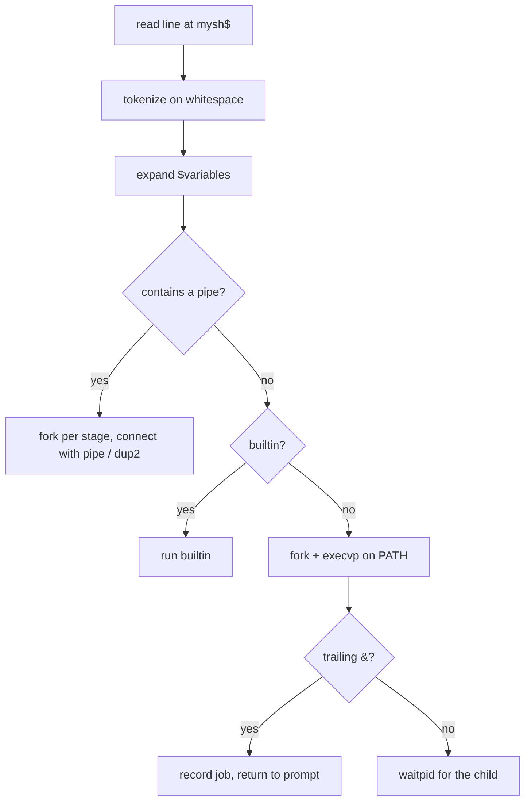

# Custom Shell

A Unix shell written in C for UofT's CSC209. It prints a `mysh$` prompt, splits
each line into tokens, expands variables, and runs the result as a builtin, an
external program, or a pipeline. It also supports background jobs, a built-in TCP
chat server, and a `gpt` command that turns plain English into a shell command.

## Features

- **Builtins written from scratch**: `echo`, `ls`, `cat`, `wc`, `cd`, `ps`,
  `kill`, implemented with syscalls rather than by calling the system versions.
- **External commands**: anything that is not a builtin is resolved on `PATH`
  and run with `fork` + `execvp`.
- **Pipelines**: `a | b | c`, one child per stage wired together with
  `pipe` and `dup2`.
- **Variables**: assign with `name=value`, reference with `$name`; expansion
  happens before the line runs.
- **Background jobs**: a trailing `&` returns to the prompt immediately, a
  `SIGCHLD` handler reaps finished children, and `ps` / `kill` manage the rest.
- **Signals**: `SIGINT` and `SIGTSTP` redraw the prompt instead of killing the
  shell.
- **Built-in chat server**: `start-server <port>`, `start-client <host> <port>`,
  `send <msg>`, `close-server`. Handles multiple clients with a username
  handshake and newline-delimited framing over non-blocking sockets.
- **`gpt` command**: `gpt "how much disk is free"` sends the prompt to the
  OpenAI API (`gpt-4o-mini`), prints the suggested command, and for task-style
  prompts offers to run it through the shell's own parser. A small denylist
  refuses obviously destructive suggestions such as `rm -rf /`, fork bombs,
  `mkfs`, `shutdown`, and `reboot`.

## How a line runs



## Build and run

Needs `gcc`, `libcurl`, and `cJSON`:

```bash
# Debian / Ubuntu
sudo apt install libcurl4-openssl-dev libcjson-dev

cd src
make
./mysh
```

The build runs with `-Wall -Wextra -Werror` and compiles under AddressSanitizer
and UBSan.

## Using `gpt`

```bash
export OPENAI_API_KEY=sk-...
mysh$ gpt "how much disk is free"
[GPT]: df -h
[Execute] y/n: y
```

Set `GPT_DEBUG=1` to also print the raw API response.

## Source layout

| File | Responsibility |
|------|----------------|
| `mysh.c` | prompt loop, signal setup, top-level dispatch |
| `io_helpers.c` | input reading, tokenizing, `$var` expansion, output |
| `builtins.c` | builtin implementations and the background-job table |
| `commands.c` | external exec, pipelines, chat server and client |
| `variables.c` | shell variable storage |
| `gpt.c` | OpenAI request, response parsing, execute-confirm prompt |
