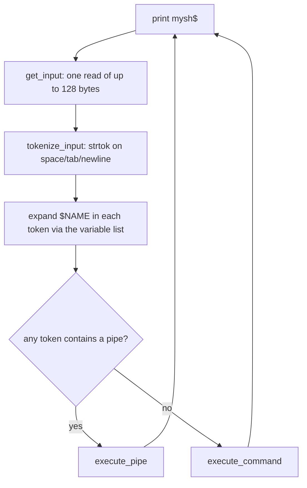
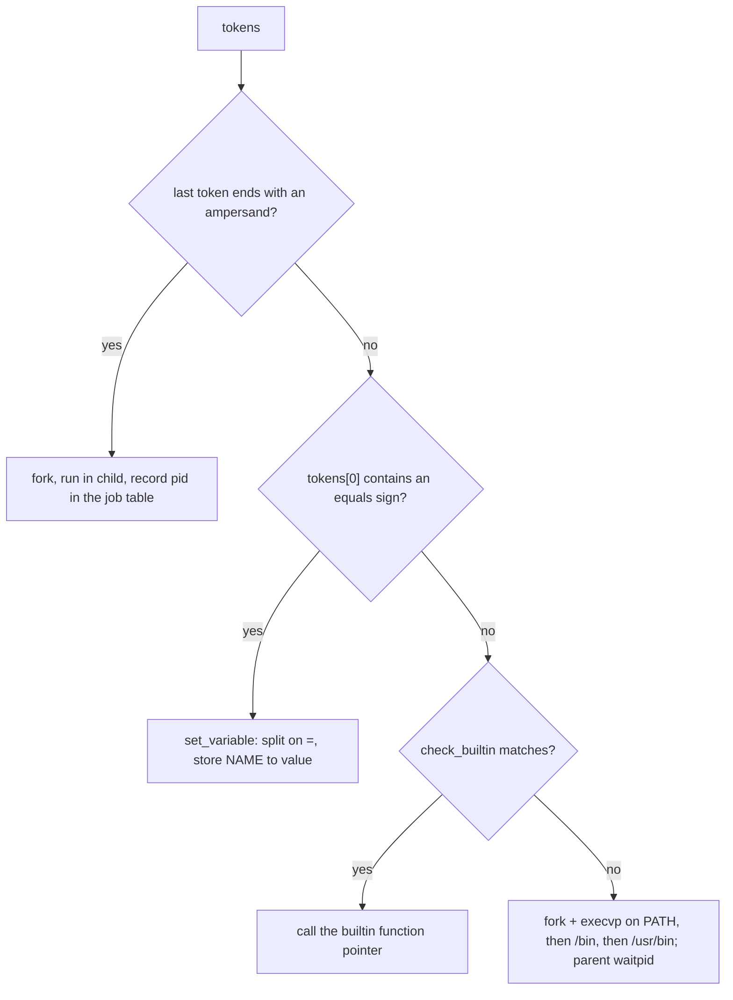
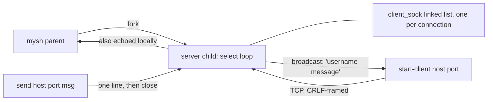
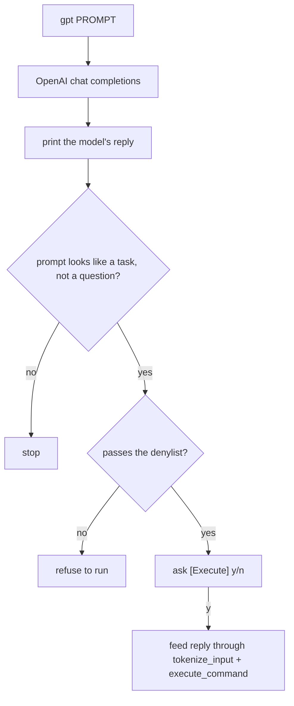

# Custom Shell

A Unix shell written in C for UofT's CSC209. It reads a line at the `mysh$`
prompt, splits it into whitespace tokens, expands `$variables`, and runs the
result as a builtin, an external program, or a pipeline. On top of the base
shell it adds background jobs, a forked TCP chat server with a matching client,
and a `gpt` builtin that turns plain English into a shell command.

## The read-eval loop

`main` in `mysh.c` installs two signal handlers and loops forever:



- **`SIGINT`** is caught and simply reprints the prompt, so Ctrl-C never kills
  the shell. Each `execvp` child resets `SIGINT` to the default so foreground
  programs still take it.
- **`SIGCHLD`** runs a reaper that `waitpid`s every finished child with
  `WNOHANG` and prints a bash-style `[n]+ Done <cmd>` line for background jobs.
- Lines longer than 128 bytes are rejected with `ERROR: input line too long`
  and the rest of the line is drained.

## How a command is dispatched

`execute_command` (in `commands.c`) decides what a non-pipeline line is:



Variables live in a singly linked list (`variables.c`); assignment is just a
token with an `=` in it, so `x=hello` then `echo $x` works with no special
syntax. Expansion happens in the tokenizer: each token is split on `$` and every
piece is looked up and substituted (a bare `$` is left literal, values are
truncated to 128 bytes).

## Builtins

`check_builtin` does a linear scan of a name table and returns a function
pointer. All of these are reimplemented from syscalls rather than by calling the
system versions:

| Builtin | Notes |
|---------|-------|
| `echo` | args joined with single spaces |
| `ls [path]` | flags: `--f <substr>` filter, `--rec` recursive, `--d <n>` max depth; walks with `opendir`/`readdir` |
| `cat [file]` | reads the file, or stdin when stdin is not a TTY |
| `wc [file]` | prints word / character / newline counts; stdin fallback like `cat` |
| `cd <path>` | absolute or relative; `...` means `../../`, `....` means `../../../` |
| `ps` | lists background jobs (pid and command) |
| `kill <pid> [signal]` | default `SIGTERM`; validates the signal number |
| `gpt [prompt...]` | see below |
| `start-server` / `start-client` / `send` / `close-server` | see below |

Because each pipeline stage calls back into `execute_command`, builtins also run
as pipe stages; `cat` and `wc` fall back to stdin precisely so they work in the
middle of a pipeline.

## Pipelines

`execute_pipe` splits the tokens on `|` into one argv per stage, creates
`num_pipes` pipes, and forks one child per stage. Stage `i` wires
`pipes[i-1][0]` to stdin (if not first) and `pipes[i][1]` to stdout (if not
last) with `dup2`, closes every pipe fd, then runs its stage through
`execute_command`. The parent closes all pipe fds and waits for every child. A
trailing `&` on a pipeline runs the whole thing in one backgrounded child.

## Background jobs

A trailing `&` is stripped, the command is run in a forked child, and the pid,
command string, and a job number go into a fixed-size table. `add_bg_process_*`
prints `[n] <pid>` on launch; the `SIGCHLD` reaper calls `remove_bg_process`,
which prints `[n]+ Done ...` and reprints the prompt. `ps` lists the table and
`kill` removes an entry when it sends `SIGTERM`.

## Built-in chat server

`start-server <port>` sets up a listening socket (`SO_REUSEADDR`, backlog 128)
and then **forks**. The child runs a `select()` event loop; the parent returns
to the prompt immediately and keeps the child's pid so it can be signalled
later.



- Messages are framed with `\r\n`; `read_from_socket` buffers partial reads and
  `find_network_newline` / `get_message` pull out one line at a time (the
  standard CSC209 network-newline protocol).
- New connections get an auto-assigned `clientN:` username and are appended to a
  `client_sock` linked list; `\connected` from a client replies with the current
  count, anything else is broadcast to every client and printed locally.
- `start-client <port> <host>` is an interactive client: a `select()` loop over
  stdin and the socket, sending typed lines (with `\n` rewritten to `\r\n`) and
  printing framed messages from the server. It installs a no-op `SIGINT` handler
  so Ctrl-C does not tear down the session.
- `send <port> <host> <msg...>` is fire-and-forget: connect, write one framed
  line, close, do not wait for a reply.
- `close-server` closes all client sockets and the listener, frees state, and
  `SIGTERM`s the server child. The same cleanup runs on shell exit.

## The `gpt` builtin

`gpt "how much disk is free"` sends the prompt to the OpenAI chat completions
API (`gpt-4o-mini`, via libcurl, parsed with cJSON) under a fixed system prompt
that asks for "the cleanest Bash command only".



The denylist blocks obvious foot-guns (`rm -rf /`, fork bombs, `mkfs`,
`shutdown`, `reboot`). With no argument, `gpt` opens a `(gpt)>` sub-prompt that
loops until `exit`. Set `OPENAI_API_KEY`; `GPT_DEBUG=1` also prints the raw
response.

## Build and run

Needs `gcc`, `libcurl`, and `cJSON`:

```bash
# Debian / Ubuntu
sudo apt install libcurl4-openssl-dev libcjson-dev

cd src
make
./mysh
```

The `Makefile` builds with `-Wall -Wextra -Werror` and
`-fsanitize=address,leak,undefined`.

## Source layout

| File | Responsibility |
|------|----------------|
| `mysh.c` | prompt loop, signal setup, pipeline vs command split, exit cleanup |
| `io_helpers.c` | `read`-based input, tokenizer, `$` expansion, `write`-based output |
| `variables.c` | linked-list variable store |
| `builtins.c` | every builtin, the background-job table, the chat server child |
| `commands.c` | external exec, `execute_pipe`, socket helpers, client list |
| `gpt.c` | OpenAI request, response parsing, safety denylist, execute-confirm |
